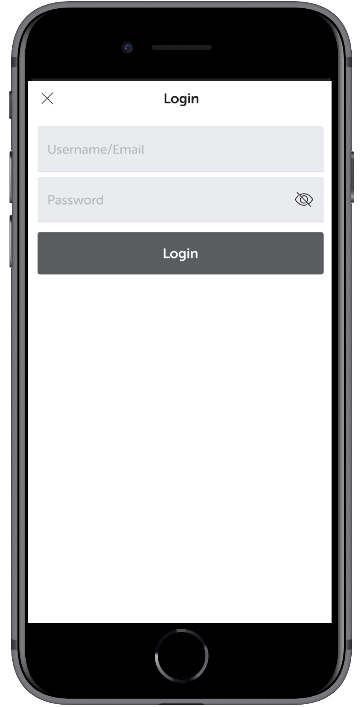
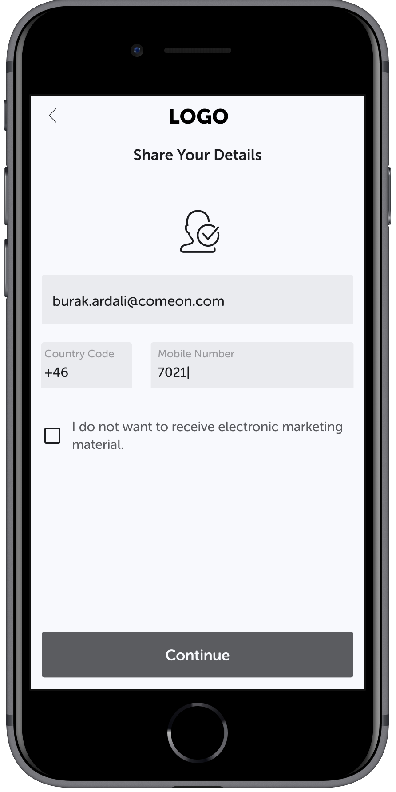
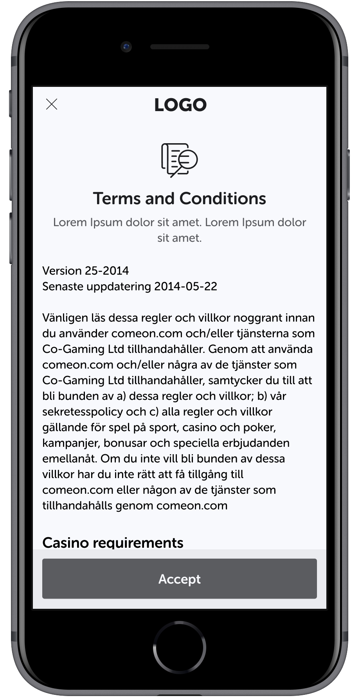
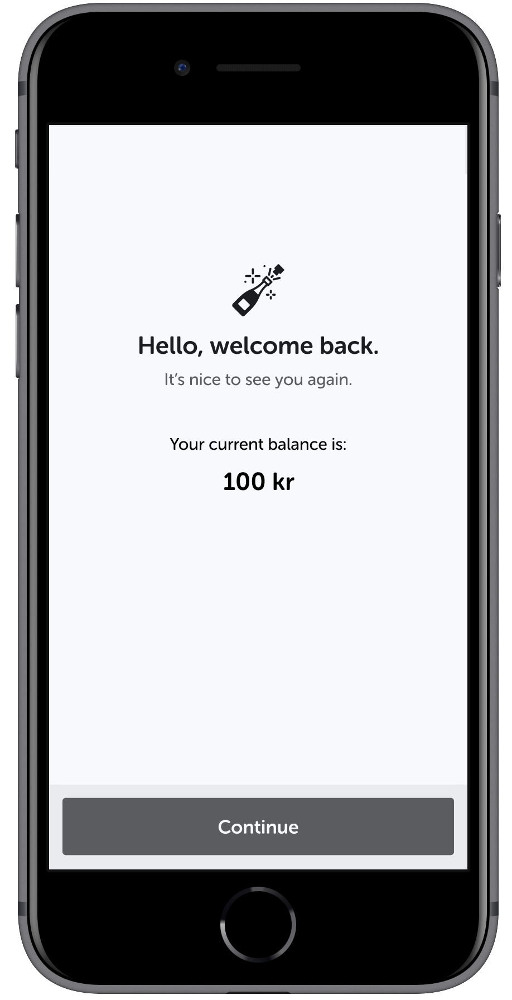

# Coding Assignment – Frontend Developer

Please note that this is not a comprehensive exercise and you may do it as per your convenience. Please feel free to make any assumptions however please mention them somewhere either in the code or in a README.

It’s not important to do a lot however your solution will set the context for discussion over the interview, so try to account for everything you would need when it comes to architecting a _seamless, responsive, performant and slick user-interface._

## Description

We want you to develop a **registration and login flow** which includes the following screens:

### 1. Registration/Login Screen

   
   <br/>
   <br/>

### 2. User Information Screen

   
   <br/>
   <br/>

### 3. Terms and Conditions Screen

   
   <br/>
   <br/>

### 4. Welcome Screen

   
   <br/>
   <br/>

First screen is common for both registration and login. On successful authentication, based on the sample/mocked response, show the appropriate screen.

The screens provided are only wireframes and you can get creative with the actual look and feel of the app. You can use any fonts, icons, images, svgs etc of your preference. You can use any UI library to build your components.

User should be able to navigate between different steps of the flow seamlessly, without losing state and if the user drops off, the data should be persisted and upon returning, user should be able to resume from the same screen.

## Mock Server

We are using json-server to run a mock server.

Steps to run:

```
npm install

```

```
npm start

```

### API

 #### Authenticate existing user and register for new users. (for screen 1) 
```
POST  /authenticate
``` 

Sample Payload 

```
{
    username: "harish.kulur",
    password: "secret"
}

```

Successful Response **200 OK**

```
{
    id: 0,
    username: "harish.kulur",
    showEmailPhoneScreen: true,
    showTermsAndCondition: false,
    showWelcomeScreen: false
}

```

Failure Response **401 Unauthorized**

```
{
   status: "FAILURE",
   response: {
      errorKey: "INVALID_CREDENTIALS",
      errorDescription: "Invalid username and password"
   }
}

```

 #### For updating player details. (for screen 2,3,4) 

```
PUT /player
``` 

Sample Payload for screen 2 

```
{
   id: 0,
   username: "harish.kulur",
   password: "secret",
   email: 'john.doe@comeon.com',
   phone: "46-700111000",
   acceptMarketing: true
}

```

Sample Response for screen-2  (**200 OK**)

```
{
   id: 0,
   username: "harish.kulur",
   showEmailPhoneScreen: false,
   email: 'john.doe@comeon.com',
   phone: "46-700111000",
   acceptMarketing: true,
   showTermsAndCondition: true,
   showWelcomeScreen: false
}

```

Refer to the players object in **server.js** for full API. Feel free to edit **server.js** if needed.

## Must have

- Use React and other libraries from the React ecosystem if needed.

## Good to have

- Good Tooling.
- Unit Tests
- Documentation

## Deliverables

Start with an empty public GitHub repository and keep committing code as you develop your solution. Repository must include a README file which provides instructions on how to build and
run the app. As a deliverable provide the URL to the repository.

Good luck, and happy coding!

## Found a bug?

Pull requests are welcome. 
